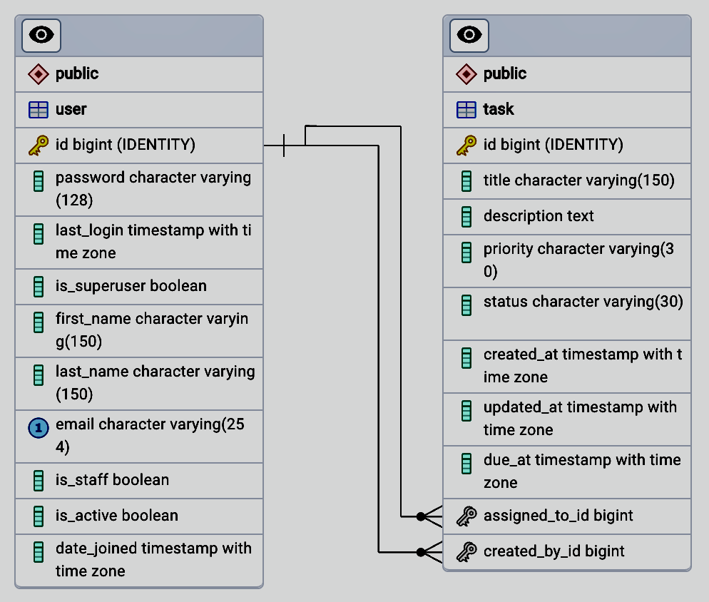

# NIYO Task Management System API

The Task Management API is a RESTful API built using Django REST Framework (DRF) for managing tasks. It provides endpoints for performing CRUD operations on tasks, user authentication using JWT tokens, and input validation to ensure data integrity and security.

[](https://github.com/osayiakoko/niyo-tms/actions/workflows/ci-pipeline.yml)

## Table of Contents

- [Project Name](#niyo-task-management-system-api)
  - [Table of Contents](#table-of-contents)
  - [Stack used](#stack-used)
  - [Getting Started](#getting-started)
    - [Installation](#installation)
    - [Running on Docker](#running-on-docker-recommended)
    - [Running on Local machine](#running-on-local-machine)
  - [API Endpoints](#api-endpoints)
  - [Database Models](#database-models)
  - [Features](#features)
  - [CI Pipeline](#ci-pipeline)
  - [Contributing](#contributing)
  - [License](#license)


## Stack used
- Python
- Django: Rest framework
- Django channels
- Pytest
- PostgreSQL


## Getting Started

### Installation

Before running the project, ensure you have the following prerequisites installed:
- **If using Docker to run the project.** (Recommended).
  - [**Docker Desktop**](https://docs.docker.com/engine/install/)
- **If running directly on your Local machine**
  - [**Python 3.11**](https://www.python.org/downloads/release/python-3118/)
  - [**Poetry 1.7**](https://python-poetry.org/docs/#installation): Python package manager
  - [**PostgreSQL**](https://www.postgresql.org/download/): Database.
  - [**Makefile**](https://sp21.datastructur.es/materials/guides/make-install.html): Compile/Build automation  tool.
    ```bash
    # MacOS
    brew install make
    ```

Additionally, create a `.env` file in the root directory by copying the `.env.sample` file.<br>
If running on Local machine, ensure to updat the .env file with the correct details for your PostgreSQL database credentials. <br>
You can leave `.env` details as it is, if using docker-compose.

### Running on Docker (Recommended)
If you prefer to run the project on Docker using Docker-compose, a Docker-compose file is provided in the root directory. Ensure Docker Desktop is installed and running, then simply execute the following command:

```bash
docker compose -f docker-compose.yml up  --build
```

This command will start the containers for PostgreSQL and other services specified in the docker-compose file. <br>
Access API via [locahost](http:localhost:8000/)

### Running on Local machine

1. **Create & activate a virtual environment**
    ```bash
    # Create virtual environment
    python3 -m venv .venv
    # activate virtual environment: macOS/Linux
    source .venv/bin/activate
    # Windows
    .venv\Scripts\activate
    ```
2. **Installing Dependencies**
    ```bash
    poetry install --no-root
    ```
3. **Database Setup**<br>
    Ensure PostgreSQL is running and a database is created with the details specified in the .env file.
3. **Running Commands**<br>
You can run various commands using the Makefile provided in the project:
    ```bash
    # Install dependencies
    make install

    # Create database migrations
    make migrations

    # Apply database migrations
    make migrate

    # Create a superuser
    make superuser

    # Or create superuser with details in .env file
    make provisionsuperuser

    # Run the development server
    make runserver
    ```

## API Endpoints

The following endpoints are available in the Task Management API:

### Account Endpoints

- `POST /v1/account/me`: Alternate endpoint to get loggedin user details.
- `POST /v1/account/users`: Retrieve a list of all users in the system.

### Authentication Endpoints

- `POST /v1/auth/register/`: Register a new user.
- `POST /v1/auth/login/`: Authenticate and generate JWT tokens for a user.
- `POST /v1/auth/change-password/`: Change the password for the authenticated user.
- `POST /v1/auth/refresh-token/`: Refresh the JWT access token using the refresh token.

### Task Management Endpoints

- `POST /v1/tasks/`: Create a new task.
- `GET /v1/tasks/`: Retrieve a list of all tasks.
- `GET /v1/tasks/{id}/`: Retrieve details of a specific task.
- `PUT /v1/tasks/{id}/`: Update details of a specific task.
- `PATCH /v1/tasks/{id}/`: Partially update details of a specific task.
- `DELETE /v1/tasks/{id}/`: Delete a specific task.

### Miscellaneous Endpoints

- `GET /health-check`: Check the health status of the API service.

### Django Admin Endpoint

- `/admin`

### API Documentation Endpoints

Explore the API documentation using Swagger UI or Redoc. Visit either of these endpoints in your browser to access them:
- `GET /swagger-ui`
- `GET /redocß`

## Database Models

The Task Management API uses the following data models:

- `User`: Represents a user in the system.
- `Task`: Represents a task created by a user with administrative right.




## Features
### Authentication
Authentication in the Task Management API is implemented using JSON Web Tokens (JWT). To access protected endpoints, clients must include a valid JWT token in the `Authorization` header of their HTTP requests.

### Task management
#### Permission Features
_The task management system utilizes custom permission to regulate user access and actions._

- **Create Task**: Only admins can create tasks.
- **Update Task**: Admins can update or delete tasks they created. Users can only update status of tasks assigned to them.
- **Delete Task**: Admins can delete tasks they created.

_These rules keep things organized and secure. Admins can manage everything, while regular users only touch what's assigned to them._

### Admin CP
Django admin has been configured for superuser priveleges, login with details in .env file.
NOTE: if running on local machine, you have to create a superuser first from the steps above

### Input Validation

Input validation is implemented using Django REST Framework's serializers and validation classes. Incoming request data is validated to ensure it meets the specified criteria and to prevent any security vulnerabilities such as SQL injection or cross-site scripting (XSS) attacks.
anagement API is implemented using JSON Web Tokens (JWT). To access protected endpoints, clients must include a valid JWT token in the Authorization header of their HTTP requests.

### Real-time Data Streaming
Implement WebSocket functionality using Django Channels or libraries such as Socket.IO for real-time data streaming. This enables clients to seamlessly receive updates as tasks are created, modified, or removed in real-time.

### Integration Tests

API integration tests are included in the project to ensure the correctness and reliability of the API endpoints. Tests cover scenarios such as creating tasks, retrieving tasks, updating tasks, deleting tasks, and handling authentication.
```bash
# command to run test on local machine
make test
```

## CI Pipeline

The Continuous Integration (CI) pipeline automates the process of testing and quality assurance for the project. It ensures that changes made to the codebase meet certain standards and do not introduce errors or bugs.

### Workflow Triggers

The CI pipeline is triggered automatically in two scenarios:
- When a pull request is opened or updated for the `main` or `dev` branches.
- When code is pushed to the `main` or `dev` branches.

_The CI pipeline is crucial for maintaining code quality and ensuring that the application functions correctly._

## Contributing

Contributions to the Task Management API are welcome! If you find any bugs or have suggestions for improvements

### Pull Request (PR) Guidelines

Please ensure that your PR meets the following criteria:

- **PR Description:** Provide a clear and informative description of your PR, including details about the feature or fix being implemented.

- **Title Format:** Start the title of your PR with the work group or issue identifier in square brackets, followed by a brief description.

- **File Inclusion:** Check that no additional files are included by mistake, such as `.vscode` or other sensitive files. Only relevant files related to your changes should be included.

- **Tests and Coverage:** Ensure there are proper tests covering the code you've added or modified. Aim for good code coverage to ensure thorough testing of the functionality.

- **Documentation:** Make sure the code is properly documented, either with comments in the code or with a dedicated documentation file. This helps future developers understand the purpose and usage of the code.

If your PR addresses an existing issue, reference the issue number in the description or title (e.g., "Fixes #123").

Be responsive to feedback and comments from reviewers. Address any concerns or suggestions promptly.


## License

This project is licensed under the MIT License - see the [LICENSE](LICENSE) file for details.

